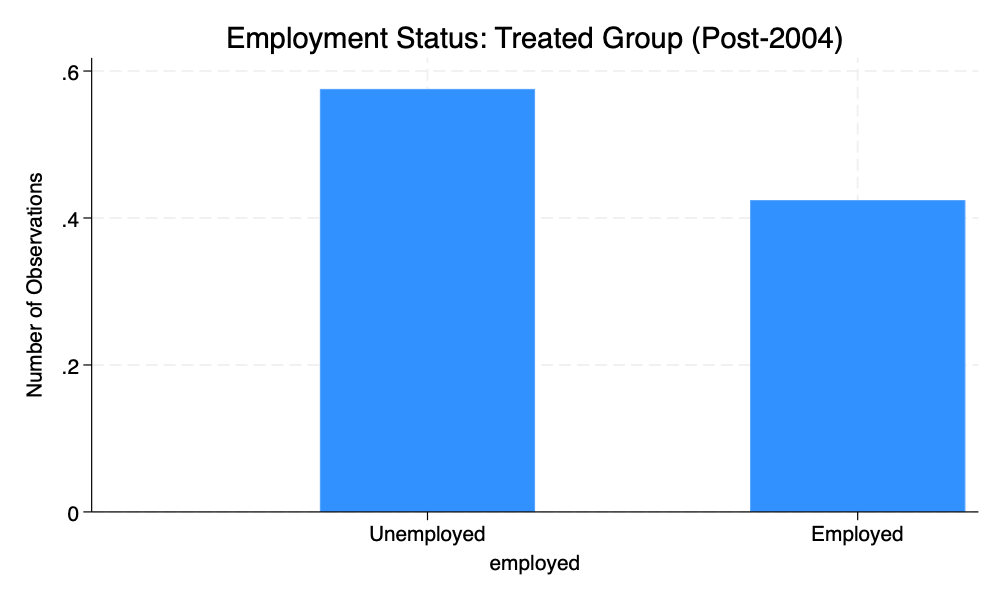

# Paid-Leave-TWFE-Replication
Empirical replication and extension of Rossin-Slater et al. (2011) using TWFE and staggered DiD models in Stata.
# 📊 Paid Leave Policy – TWFE Replication & Extension

This project replicates and extends the findings of Rossin-Slater et al. (2011), analyzing the effects of California’s Paid Family Leave law on female labor market outcomes using CPS microdata (1999–2010).

---

## 🔍 Overview

- **Methodology**:  
  - Two-Way Fixed Effects (TWFE) regression using `xtreg`, `areg`  
  - Event-study design via staggered Difference-in-Differences  
  - Robustness checks with clustered standard errors  
- **Data**:  
  - IPUMS-CPS, 1999–2010 sample  
  - Key variables: `statefip`, `sex`, `empstat`, `nchild`, `yngch`

---

## 📁 Project Structure

-**Paid-Leave-TWFE-Replication code**
  -TWFE Regression Analysis.do
  -Staggered DiD.do
 - TWFE GR.do
- **Data**:  
│ ├── cps_00001.dta
│ └── TWEF regression findings.dta
─ **output**:
│ ├── hist_employed_treated.png
│ ├── twfe_log.txt
─ **docs**
│ ├── Project Essay.pdf
│ └── Project question 2025.pdf

---

## 📈 Sample Output

---

## 🧠 Key Findings

- Paid leave significantly improved labor force attachment among mothers with young children.  
- Event-study reveals strongest post-treatment effect in years 2–3 following implementation.  
- Heterogeneous impacts observed based on state-level economic characteristics.

---

## 🛠️ Tools Used

- **Stata 17**  
- **LaTeX + Markdown** for documentation  
- **GitHub** for versioning  
- Data cleaning, regression modelling, and visualization via `.do` files

---

## ✍️ Author

**Berken Arslan**  
MSc in Economics & Data Science, University of Nottingham  
[LinkedIn](https://www.linkedin.com/in/berkenarslan) | [GitHub](https://github.com/berkenarslan)

